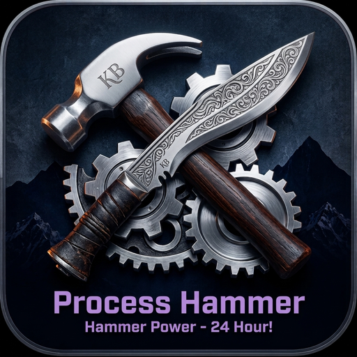

<div align="center">
  
</div>

# ⚡ Process Hammer

**See everything about your Windows PC — and take control of it.** A free, open-source system
dashboard *and* per-process tuner in one fast, modern app. No paywall, no telemetry, no install —
just one portable `.exe`.

   

One window instead of a pile of utilities: live hardware readouts, a process table you can actually
tune, and deep system/security info — all read live from your machine, nothing hardcoded.

<div align="center">

### 💖 Free forever — powered by people like you

No paywall, no ads, no telemetry. If Process Hammer earns a spot in your toolkit,
a small tip keeps development going. **Thank you!** 🙏

<a href="https://ko-fi.com/hammerpower">
  
</a>

</div>

> 📸 **Screenshots go here.** Drop a couple of PNGs and a short GIF into `docs/screenshots/` and
> embed them at the top before sharing.

---

## 🚀 Get it

Two ways to run Process Hammer — both give you the exact same single portable `.exe`, no installer,
no telemetry:

- **⬇️ Download a release** — grab the latest ready-to-run build from the
  **[Releases](https://github.com/KrishnaMBhattarai/process-hammer/releases)** tab and just run it.
  *(Optional: [verify the SHA-256](#-verify-your-download-sha-256) first.)*
- **🛠️ Build it yourself** — clone the repo and compile from source in a couple of commands. See
  **[Build from source](#-build-from-source)** below.

---

## 🎮 Built for gamers & PC builders

- **Tune games for smoother frames.** Set a process to **High priority**, pin it to your **P-cores**,
  turn **efficiency mode off**, and force the **high-performance GPU** — then **Apply** so it's saved
  as a rule and re-applied automatically every time that app launches.
- **Know your rig cold.** Per-core **P/E layout with live clocks**, **RAM speed + timings + part
  numbers**, **true VRAM** (not the WMI 4 GB lie), monitor **connection (HDMI/DP) + HDR**, disk
  **health**, and **live temps / fans / voltages** on the Sensors tab.
- **Debloat & audit.** See exactly **what runs at startup**, browse **installed software** and
  **services** as sortable tables, and check **security** (Defender, Firewall, BitLocker, TPM,
  Secure Boot).
- **Share your specs.** One click → **Copy specs / Export report** as clean text for a forum post
  or a support ticket.

---

## ⚠️ A note on protected processes

Some processes can be **read but not modified by any user-mode tool** — most online games with
**anti-cheat**, and core Windows/system processes. Windows denies the write even to an administrator.
For those, per-process settings (priority, affinity, I/O, memory, …) will report **Failed (access
denied)**, and Process Hammer tells you so with a red popup instead of silently doing nothing.

What still works on a protected app:

- **GPU preference** → *High performance* — a per-app registry setting; takes effect the next time the
  app launches.
- **Power plan** → *High performance* — system-wide.
- Free up resources for it indirectly by lowering the **priority** or turning on **efficiency mode**
  for *other* background apps (those aren't protected).

This is a Windows limitation, not a bug — no user-mode program can get around it.

---

## 📥 Download

1. Grab **`ProcessHammer_SelfContained_vX.Y.Z.exe`** from the
   **[Releases page](https://github.com/KrishnaMBhattarai/process-hammer/releases/latest)**.
   *(Portable single file, ~72 MB — bundles .NET, so **nothing else to install**.)*
2. Double-click it and accept the **UAC prompt** (admin is required to read/change other processes).

### ✅ Verify your download (SHA-256)

Every release ships a matching `.sha256` file. Confirm your download wasn't tampered with:

```powershell
# PowerShell — compare against the hash in the .sha256 file on the release
Get-FileHash .\ProcessHammer_SelfContained_vX.Y.Z.exe -Algorithm SHA256
```

If the hash matches the one inside `ProcessHammer_SelfContained_vX.Y.Z.exe.sha256`, the file is
authentic and unmodified.

### ⚠️ SmartScreen / antivirus

The exe isn't code-signed yet, so **SmartScreen may warn** — click **More info → Run anyway**. The
live **Sensors** tab loads the open-source **LibreHardwareMonitor** driver to read temperatures, which
some antivirus flags; if it's blocked, sensors show `—` and everything else still works. Prefer to be
safe? **Build it yourself** (below).

---

## 🧰 What's inside

**Processes** — a live, sortable table (CPU %, priority, affinity, I/O, memory, threads, RAM, active
rules). Right-click any process for the full tuning menu:

- **CPU priority** (Idle → Realtime)
- **CPU affinity** — a checkbox per logical core, plus **All / P-core / E-core** presets (a *hard*
  limit: the process runs only on the ticked cores)
- **CPU sets** — the *soft* version of affinity (prefer these cores, but Windows may still use others)
- **I/O priority**, **Memory priority**, **GPU priority**, **GPU preference**, **Efficiency mode
  (EcoQoS)**, **Priority boost**
- **Power plan** (switch the active Windows power scheme)
- **Trim memory**, **Copy rule**, **Remove rule**, and **Restart / Restart as admin / Close / Terminate**

Every option shows a **checkmark on what's currently applied**. The right-hand **Rule** panel is a
**live mirror** of the same state — change a setting in either place and the other updates instantly.

> **Live tweak vs. saved rule — the one thing to know.** Changing a setting from the **right-click
> menu** takes effect **immediately, but only on that one running process** — it's a one-off live
> tweak that is **not saved**. To make it stick, hit **Apply** in the Rule panel: that writes a
> **persistent rule** (matched by process name) which Process Hammer then re-applies automatically to
> *every* matching process, and keeps re-applying after the process or the app restarts. In short:
> **right-click = try it now, Apply = make it permanent.**

Live activity log; import/export rules as JSON.

**Rules** — every saved rule in one place, showing exactly what it applies (priority, cores, I/O,
memory, eco, boost, CPU sets, GPU) and whether its process is running. Apply, enable/disable or remove
rules here, next to a built-in **reference guide** explaining what each setting does.

**Runs in the tray** — closing the window keeps Process Hammer running in the system tray so your
rules stay enforced. Right-click the tray icon to **Show** it, toggle **Start with Windows** (a logon
task with highest privileges, so it starts elevated with no UAC prompt), or **Exit**.

**Info tabs:**

| | | |
|---|---|---|
| **System** – live tiles + summary | **OS** – edition, build, uptime, Secure Boot | **Security** – Defender, Firewall, BitLocker, TPM |
| **Users** – accounts & admins | **Startup** – autoruns | **Software** – installed programs |
| **Services** – running / stopped | **Devices** – hardware by class | **Environment** – variables |
| **CPU** – cores, cache, live graphs | **Memory** – modules, timings | **GPU** – VRAM, driver, live graphs |
| **Display** – HDMI/DP, HDR, refresh | **Storage** – disks & volumes | **Network** – IP/DNS, Wi-Fi, throughput |
| **Sensors** – all temps/fans/volts | **Power** – battery health, plan | |

Everything is enumerated from the live system — **nothing is hardcoded**, so it works on any PC
(any CPU vendor, GPU count, monitors, adapters…).

---

## 🎛️ What each option does

Every setting is **optional** — a rule only touches what you choose; anything left at **"Leave
unchanged"** is untouched. Unless noted, settings apply **instantly** to the running process and last
until it exits or you remove the rule.

| Option | What it controls | Values (low → high effect) |
|---|---|---|
| **CPU priority** | How often the scheduler gives it CPU time | **Idle · Below Normal · Normal · Above Normal · High · Realtime** — higher = more, more-frequent time slices. *Realtime* can starve Windows itself; use sparingly. |
| **CPU affinity** *(hard limit)* | Which cores it's **allowed** to run on | **All cores · Performance (P) cores · Efficiency (E) cores · Custom** (tick individual cores). It will **never** run on unticked cores. |
| **CPU sets** *(soft hint)* | Which cores it **prefers** | **All · P-cores · E-cores · Custom.** A preference only — Windows may still use other cores under load. Gentler than affinity. |
| **I/O priority** | Disk read/write scheduling | **Very Low · Low · Normal.** Lower = yields the disk to other apps (good for background tasks). |
| **Memory priority** | How soon its RAM pages get trimmed under memory pressure | **Very Low · Low · Medium · Below Normal · Normal.** Higher = pages stay resident longer. |
| **Efficiency mode** *(EcoQoS)* | Power/heat vs. performance | **On** = parked on E-cores at low clocks (cool, quiet, battery-friendly) · **Off** = full performance. |
| **Priority boost** | Windows' automatic focus/UI boost | **Enabled** (default, snappier when focused) · **Disabled** (steady, predictable — good for benchmarks). |
| **GPU preference** | Which GPU the app uses | **System default · Power-saving (iGPU) · High performance (dGPU).** Saved in the registry; **takes effect on next launch.** |
| **GPU priority** | Scheduling priority for its GPU work | **Idle · Below Normal · Normal · Above Normal · High · Realtime.** |
| **Power plan** | The **system-wide** Windows power scheme | **High Performance · Balanced · Power Saver** (+ any custom plans). Affects the whole PC and is a one-off switch — not saved in a rule. |

> **Protected processes:** most anti-cheat games and core Windows processes can be *read* but not
> *modified* by any user-mode tool — those settings will report **Failed (access denied)**. GPU
> preference and power plan still work on them.

---

## 💻 Requirements

64-bit **Windows 10 (1809+) or 11**. Administrator rights (one UAC prompt) to read/change processes.

## 🛠️ Build from source

Requires the **.NET 8 SDK**.

```powershell
dotnet build -c Release
dotnet test  -c Release     # 167 tests (see "Testing" below)
./publish.ps1               # builds both distributables into .\dist\ (+ versioned exe & SHA-256)
```

`publish.ps1` writes everything to a `dist\` folder in the repo (gitignored): a runtime-dependent
folder build and a self-contained single-file exe, plus its `.sha256`. Run `./publish.ps1 -Release`
to also publish the GitHub release (needs the `gh` CLI).

Releases are automated: **GitHub Actions** builds, tests, and publishes the release (with its SHA-256)
on every push to `main` — so the [Releases page](https://github.com/KrishnaMBhattarai/process-hammer/releases)
always matches the current `<Version>`.

### ✅ Testing

**167 tests**, run on Windows:

- **Pure logic** — affinity-mask parsing (whitespace, ranges, out-of-range), P/E-core presets, rule
  matching & normalization, config serialization/round-trips, and the view-model state that keeps the
  menu and the Rule panel in sync. Core logic sits at **~89% line coverage**.
- **Functional read-back** — every action (CPU priority, affinity, CPU sets, I/O, memory, GPU
  priority, GPU preference, efficiency, priority boost, trim, power plan, terminate) is applied to a
  real process and then **read back** to prove it took effect — not just that a call returned. State
  is always restored afterwards.

The rest is UI (XAML), live process enumeration, and WMI/sensor hardware readers — exercised by
running the app, not by unit tests.

## 🗺️ Roadmap

Code signing (to drop the SmartScreen warning) · per-process GPU % · left-sidebar navigation ·
localization.

## 🤝 Contributing

PRs welcome — see **[CONTRIBUTING.md](CONTRIBUTING.md)**. Best first help: **test on your hardware**
and file issues for anything that reads wrong.

## ⚖️ Disclaimer

Process Hammer is free software provided **"as is", with no warranty — use it at your own risk.**
Changing process/CPU/GPU/power settings can affect system stability, and using it on online games or
other protected software may violate that software's terms; **you are solely responsible for how you
use it.** To the maximum extent permitted by law, the authors are **not liable** for any damage, data
loss, account actions, or other consequences. Nobody is forcing you to install or run it.

This is an **independent open-source project** — not affiliated with, endorsed by, or copied from any
other company or product; it's built entirely on publicly documented Windows APIs. Full text:
**[DISCLAIMER.md](DISCLAIMER.md)**.

## 📄 License

[MIT](LICENSE). Architecture & native-API notes in [`docs/`](docs/).
